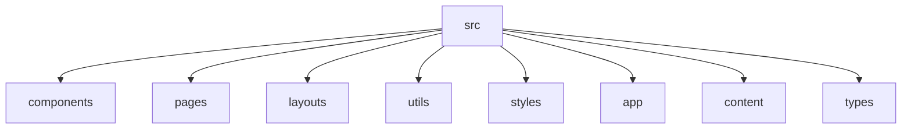

# Blastro 🚀 - A Simple Astro Website


## 🗂️ Description

Blastro is a modern Astro-based website built for showcasing blog posts and providing a clean, user-friendly experience. It leverages TypeScript, Tailwind CSS, and Astro's powerful features to create a fast and efficient platform for content presentation. This project is designed for developers and content creators looking for a flexible and scalable solution for their online presence.

## ✨ Key Features

### 🎨 Blog Post Display
*   Displays blog posts with titles, excerpts, and images.
*   Supports dynamic routing for individual blog posts.
*   Utilizes Markdown for content formatting.

### ⚙️ Content Management
*   Uses Astro's `content` feature for easy blog post management.
*   Supports MDX for mixing JavaScript and JSX within Markdown.

### 🛠️ UI Components
*   Reusable components like ButtonPrimary, HeaderLink, and Footer for consistent styling.
*   A base layout for consistent page structure.
*   A blog card component for displaying individual blog posts.

### 🚀 Performance & Accessibility
*   Integrates Google Analytics and Clarity for performance monitoring and analytics.
*   Includes a base head component for managing metadata and SEO.

### 📱 Responsive Design
*   Utilizes Tailwind CSS for responsive design across different devices.

## 🗂️ Folder Structure



## 🛠️ Tech Stack

*   TypeScript
*   Astro
*   Tailwind CSS
*   MDX
*   JavaScript
*   Google Analytics
*   Clarity

## ⚙️ Setup Instructions

1.  **Clone the repository:**

    ```bash
    git clone https://github.com/abhraneeldhar7/blastro.git
    cd blastro
    ```

2.  **Install dependencies:**

    ```bash
    npm install
    # or
    yarn install
    ```

3.  **Run the development server:**

    ```bash
    npm run dev
    # or
    yarn dev
    ```

4.  **Open your browser and navigate to `http://localhost:3000` to view the website.**
---
