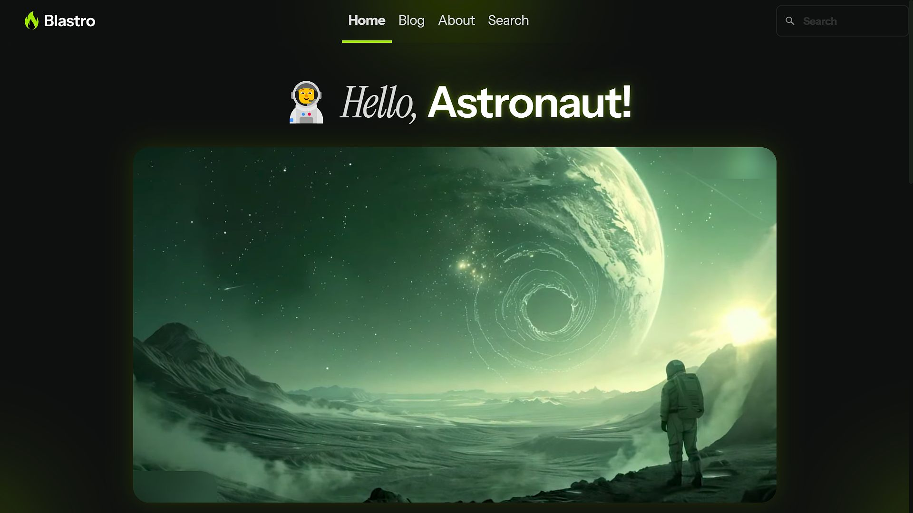
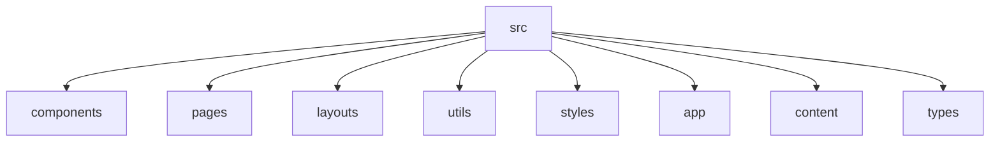

# Blastro 🚀



## 🗂️ Description

Blastro is a modern Astro-based website built for showcasing blog posts and providing a clean, user-friendly experience. It leverages TypeScript, Tailwind CSS, and Astro's powerful features to create a fast and efficient platform for content presentation. This project is designed for developers and content creators looking for a flexible and scalable solution for their online presence.

Blastro is built with a focus on performance, accessibility, and user experience. The platform uses Tailwind CSS for styling and provides a range of customizable components, including buttons, headers, and footers. With Blastro, you can easily create a professional-looking blog and start publishing your content.

Whether you're a seasoned developer or a beginner, Blastro is an excellent choice for anyone looking to create a blog. The platform is highly customizable, and its modular architecture makes it easy to extend and modify.

## ✨ Key Features

### **Core Features**
* **Blog Post Management**: Create, edit, and manage blog posts with ease
* **Google Analytics Integration**: Track your website's traffic and user behavior
* **Clarity Integration**: Gain insights into user behavior and website performance
* **Search Functionality**: Implement a robust search feature for your blog

### **Components and Styling**
* **Reusable Components**: Use pre-built components like buttons, headers, and footers
* **Tailwind CSS**: Leverage the power of Tailwind CSS for styling and customization
* **Customizable**: Easily customize the platform to fit your needs

### 🎨 Blog Post Display
* Displays blog posts with titles, excerpts, and images.
* Supports dynamic routing for individual blog posts.
* Utilizes Markdown for content formatting.

### ⚙️ Content Management
* Uses Astro's `content` feature for easy blog post management.
* Supports MDX for mixing JavaScript and JSX within Markdown.

### 🛠️ UI Components
* Reusable components like ButtonPrimary, HeaderLink, and Footer for consistent styling.
* A base layout for consistent page structure.
* A blog card component for displaying individual blog posts.

### 🚀 Performance & Accessibility
* Integrates Google Analytics and Clarity for performance monitoring and analytics.
* Includes a base head component for managing metadata and SEO.

### 📱 Responsive Design
* Utilizes Tailwind CSS for responsive design across different devices.

## 🗂️ Folder Structure



## 🛠️ Tech Stack

* TypeScript
* Astro
* Tailwind CSS
* MDX
* JavaScript
* Google Analytics
* Clarity

## ⚙️ Setup Instructions

1. **Clone the repository:**

 ```bash
 git clone https://github.com/abhraneeldhar7/blastro.git
 cd blastro
 ```

2. **Install dependencies:**

 ```bash
 npm install
 # or
 yarn install
 ```

3. **Run the development server:**

 ```bash
 npm run dev
 # or
 yarn dev
 ```

4. **Open your browser and navigate to `
