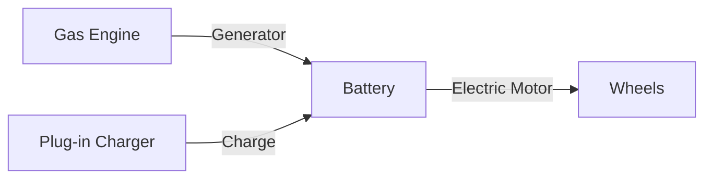

# Ford Kills the All‑Electric F‑150 Lightning – What It Means for the Future of Trucks

Ford’s latest press conference felt a lot like a plot twist in a blockbuster: the beloved all‑electric F‑150 Lightning is being shelved, and the company is pivoting to a plug‑in hybrid (EREV) version instead. For a brand that has built its modern identity around “electrify everything,” this move raises eyebrows, cash‑flow questions, and a whole lot of speculation about where the pickup truck market is headed.

Below we break down **why Ford pulled the plug**, **what the new extended‑range electric (EREV) F‑150 will look like**, and **how this shift could ripple through the EV ecosystem**. Grab a coffee, strap in, and let’s take this truck for a spin.

---  

## Why the Lightning Got the Ax

| Factor | What Happened | Why It Matters |
|--------|---------------|----------------|
| **Regulatory headwinds** | The Biden‑Era tax‑credit landscape has been trimmed, and the Trump administration’s earlier rollback of EV incentives still lingers in many states. | Less “free money” for buyers = slower adoption. |
| **Demand reality check** | EVs accounted for just **~7.5 % of U.S. new‑car sales** in early 2024, far below the 40 % target Ford set for 2030. | Ford can’t justify a high‑volume, high‑cost EV pickup when the market isn’t there yet. |
| **Production bottlenecks** | The Tennessee plant, originally earmarked for the Lightning, now needs to churn out gas‑powered models to meet short‑term volume goals. | Re‑tooling a massive assembly line is cheaper than building a brand‑new EV line from scratch. |
| **Battery‑capacity surplus** | Ford has excess lithium‑iron‑phosphate (LFP) capacity and is spinning it off into a **battery‑storage business** for utilities and data centers. | Better to monetize idle capacity than let it sit idle in a struggling EV line. |

In short, the Lightning’s cancellation is less about a sudden loss of faith in EVs and more about **aligning production with actual demand** while keeping the company financially nimble.

---  

## The New Kid on the Block: F‑150 Lightning EREV

An **Extended‑Range Electric Vehicle (EREV)** is essentially a plug‑in hybrid where the gasoline engine never directly drives the wheels. Instead, it acts as a generator to keep the battery topped up, extending the electric range dramatically.

**Key specs (as announced by Ford):**

- **Target range:** > 700 miles (combined electric + generator)  
- **Towing capacity:** Comparable to the current Lightning, thanks to the added generator power  
- **Battery pack:** Smaller than the pure‑EV version, which helps lower cost and weight  
- **Price point:** Still TBD, but Ford hints it will be **cheaper than the current Lightning**  

### Quick‑look code: How an EREV powertrain works

*The gasoline engine only runs when the battery dips below a preset threshold, acting like a mobile charger.*

---  

## Real‑World Use Cases: Who Actually Wants an EREV Pickup?

| Scenario | Why an EREV Makes Sense |
|----------|--------------------------|
| **Remote construction sites** | No charging infrastructure, but you still need zero‑emission zones for short bursts. The generator handles long hauls. |
| **Rural deliveries** | Drivers can run on electric for the first 100 mi (city stops) then let the gas generator take over for the back‑country stretch. |
| **Fleet managers** | Predictable fuel costs (gas + electricity) and lower upfront price than a full‑size EV battery pack. |
| **Adventure enthusiasts** | Camp out with the truck’s 700‑mile “range‑plus”—no need to hunt for a charger on a cross‑country road trip. |

The EREV essentially **covers the “range anxiety” gap** while still delivering a meaningful electric driving experience.

---  

## Pitfalls & Gotchas: What Could Trip Up the EREV Plan

1. **Complex warranty claims** – Managing two powertrains (electric + ICE) can lead to confusion over who fixes what.
2. **Fuel‑efficiency perception** – If the generator runs too often, the truck could end up with worse MPG than a conventional diesel.
3. **Regulatory classification** – Some states treat EREVs differently for emissions credits, potentially affecting fleet incentives.
4. **Consumer messaging** – “Hybrid” still carries a stigma for some eco‑enthusiasts; Ford must sell the *extended range* narrative, not “just another gas‑guzzler.”

### Pro tip for dealers  
Create a **side‑by‑side comparison chart** in the showroom that highlights electric‑only vs. EREV operating costs over 5 years. Numbers speak louder than slogans.

---  

## FAQs About the Lightning’s New Direction

**Q: Does the EREV still qualify for federal EV tax credits?**  
A: Not the full $7,500 credit. EREVs can snag a **$2,500 plug‑in hybrid credit** if they meet the 25‑kWh battery threshold, but the exact amount varies by income and assembly location.

**Q: Will the current Lightning owners get any upgrade path?**  
A: Ford hasn’t announced a retrofit program. Existing owners will likely receive software updates for OTA features, but a hardware swap to an EREV is improbable.

**Q: How does the 700‑mile claim hold up in real life?**  
A: The figure assumes a mix of electric driving (≈100 mi) plus generator use at optimal efficiency. Real‑world mileage will depend on load, terrain, and driving style.

**Q: What about the promised $30k midsize electric pickup?**  
A: That project is still on track for a 2027 launch, built on a new “universal” platform aimed at cutting production costs. Think of it as Ford’s answer to the “affordable EV” market segment.

---  

## Best Practices for Companies Watching This Shift

| Action | Why It Helps |
|--------|--------------|
| **Diversify powertrain strategy** | Don’t bet the farm on a single tech; mix BEVs, EREVs, and hybrids to hedge market volatility. |
| **Invest in modular platforms** | A “universal” architecture lets you swap battery packs or add a generator without a full redesign. |
| **Leverage excess battery capacity** | Turn idle LFP production into a revenue stream (energy storage, grid services). |
| **Communicate clearly** | Use plain language (“plug‑in hybrid with a built‑in generator”) instead of jargon that confuses buyers. |
| **Monitor incentive landscapes** | State‑by‑state tax credit changes can swing the cost‑benefit analysis dramatically. |

---  

## The Bigger Picture: Is the Truck Market Going Hybrid First?

Ford’s pivot suggests a **“hybrid‑first” approach for heavy‑duty vehicles**. Other OEMs—General Motors with its “Ultium” platform and Rivian with its “Adventure Series”—are also exploring range‑extending solutions for trucks and SUVs. The underlying logic is simple:

1. **Battery cost per kWh is still high** for large trucks that need 300+ miles of electric range.  
2. **Charging infrastructure** for big pickups (especially in rural America) lags far behind passenger‑car networks.  
3. **Regulatory pressure** is uneven; some states push full BEVs, while others still favor low‑emission hybrids.

If the market responds positively to the EREV model, we could see **a new segment of “long‑haul plug‑in trucks”** that blend the best of both worlds—quiet, zero‑tailpipe zones in cities, and gasoline‑backed endurance on the open road.

---  

## Final Thoughts

Ford’s decision to kill the all‑electric F‑150 Lightning isn’t a death knell for EV trucks; it’s a **strategic retreat** to a more market‑ready solution. By introducing an extended‑range plug‑in hybrid, Ford hopes to keep the electric promise alive while staying financially sane.

For developers, designers, and marketers in the automotive space, the takeaway is clear:

- **Build flexibility into your platforms**—hardware and software should accommodate both pure EV and hybrid configurations.  
- **Speak the language of real users**—range, towing capacity, and total cost of ownership matter more than “green credentials” alone.  
- **Watch the incentive tide**—tax credits can make or break a model’s profitability, especially in the first few years.

Whether you’re a fleet manager eyeing the next big truck, a tech startup dreaming up battery‑management algorithms, or just an EV enthusiast wondering where the lightning went, the new Ford EREV is a reminder that **the road to electrification is rarely a straight line**—it’s a winding, sometimes muddy, but always interesting ride.

  

  

  

[IMAGE:Concept sketch of the 2027 midsize electric pickup]  