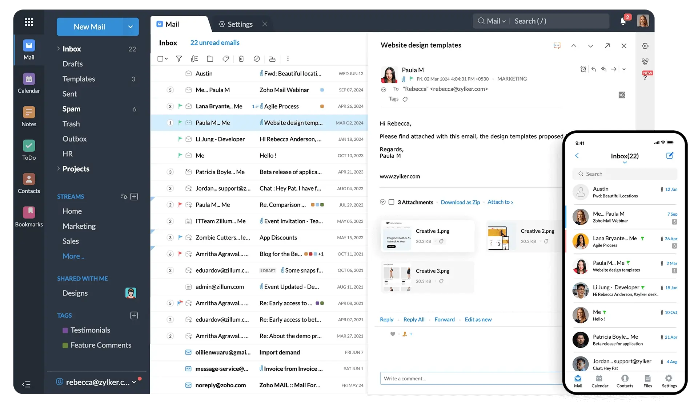

So I bought my domain: **[anish7.me](https://anish7.me)**.
Felt powerful. Felt important. Felt like… _main character energy_.

I built my website, showed it to friends, flexed a little — and then someone asked:

> “What’s your email?”

Me: “Uh… [anish7biswas@gmail.com](mailto:anish7biswas@gmail.com).”

Suddenly my aura dropped from _CEO_ to _college student submitting assignment at 2 AM._

That’s when I realized:
A cool domain is useless if your email still screams “bro uses Gmail default.”

So I went down the rabbit hole of **custom email** — and trust me, it was messy, confusing, and at one point I was staring at DNS records like they were ancient Egyptian hieroglyphs.

But I survived. And now you get the clean, simple version.

---

## The Problem Nobody Warns You About

Buying a domain is easy.
Setting up email is **not.**

At first, I thought:
“Why can’t I just connect Gmail and be done?”

Turns out email has layers:

- **Receiving emails** → your inbox
- **Sending emails** → especially from apps
- **DNS records** → MX, SPF, DKIM (sounds like Pokémon, but scarier)

Most tutorials either:

- oversimplify everything, or
- speak like they’re explaining rocket science to NASA engineers.

I needed something in between.

---

## My Final Setup (The Winner 🏆)

After experimenting, breaking things, Googling too much, and mildly panicking — I settled on this clean architecture:

```
📩 Main Inbox (receiving):  Zoho → anish7.me
📤 App Emails (sending):   Resend → info.anish7.me
🌐 DNS Manager:            Namecheap
```

In simple words:

- **Zoho = my professional inbox**
- **Resend = my app emails**
- **Namecheap = where all the magic DNS stuff lives**

No chaos. No conflict. No drama.

Just clean, smart separation.



## Why I Chose Zoho for My Main Email

I needed a real inbox. Not forwarding tricks. Not Gmail hacks. A proper email system.

Zoho’s free plan gave me:

- Custom domain email (`@anish7.me`)
- Real inbox
- Spam filtering
- Calendar
- Mobile app
- No random Google “via gmail.com” nonsense

So I went into Namecheap DNS and changed my **MX records** to:

```
@ → mx.zoho.com  (10)
@ → mx2.zoho.com (20)
@ → mx3.zoho.com (50)
```

And I deleted these:

```
mx1.forwardemail.net
mx2.forwardemail.net
```

Why?
Because only **ONE** service can control your incoming email.

Think of it like food delivery. You can’t have Swiggy _and_ Zomato both trying to deliver the same order at the same time.

Zoho became my official “post office.”

---

## Why I Used Resend for Sending Emails

Now here’s where it gets interesting.

My website sends emails like:

- Login OTP
- Password reset
- Welcome messages
- Notifications

I didn’t want these coming from my main inbox. That would be messy and weird.

So I used **Resend**, a developer-friendly email service.

Instead of using my main domain (`anish7.me`), I moved Resend to:

```
info.anish7.me
```

So now emails look like:

```
noreply@info.anish7.me
```

Professional? Yes.
Clean? Yes.
Smart? Absolutely.

I added two important DNS records in Namecheap:

- **SPF** for Resend
- **DKIM** for Resend

This tells email servers:
“Hey, this email is legit. Don’t mark it spam.”

---

## The SPF Lesson That Almost Broke My Brain

At one point, I had:

```
v=spf1 include:zoho.com ~all
v=spf1 include:resend.com ~all
```

And guess what? That’s **WRONG.**

You cannot have two SPF records. You must **merge them into one** like this:

```
v=spf1 include:zoho.com include:resend.com ~all
```

This single line basically says:

> “Emails from this domain are allowed from Zoho AND Resend.”

Once I fixed this, everything magically started working better. No spam. No rejections. No random failures.

---

## Yo, What is ForwardEmail.net though?

It’s basically just email forwarding. Like Namecheap’s free forwarding, but dressed up with techy branding.

Since I already had Zoho as my real inbox, ForwardEmail made zero sense for me.

So I deleted those records and moved on with my life.


## Testing Everything (The Moment of Truth)

After setting everything up, I tested:

1. Sent an email from Resend → landed in Zoho ✅
2. Checked spam folder → clean ✅
3. Looked at email headers → no “via gmail.com” crap ✅

At that moment, I felt like a mini DevOps engineer.

---

## Who Should Use This Setup?

If you are:

- A developer
- A freelancer
- A student with a personal brand
- A startup founder
- Or just someone who owns a domain

This setup is **perfect for you.**

It’s:

- Free (mostly)
- Clean
- Professional
- Scalable
- Not overcomplicated

You get the best of both worlds.

---

## Final Thoughts

Your domain is your identity on the internet.

Your website is your face.
Your email is your voice.

If your website looks premium but your email is still `lmaobrooo@gmail.com`, you’re doing yourself dirty.

Setting this up once saves you embarrassment, spam problems, and future headaches.

And now?
When someone asks me my email, I proudly say:

> “It’s [hello@anish7.me](mailto:hello@anish7.me).”

That hits different.
